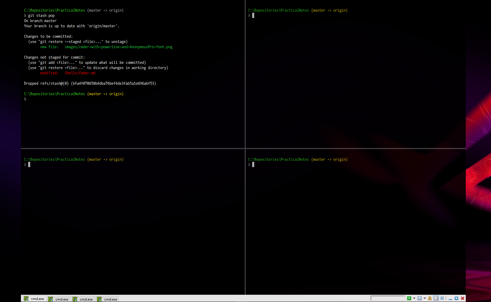
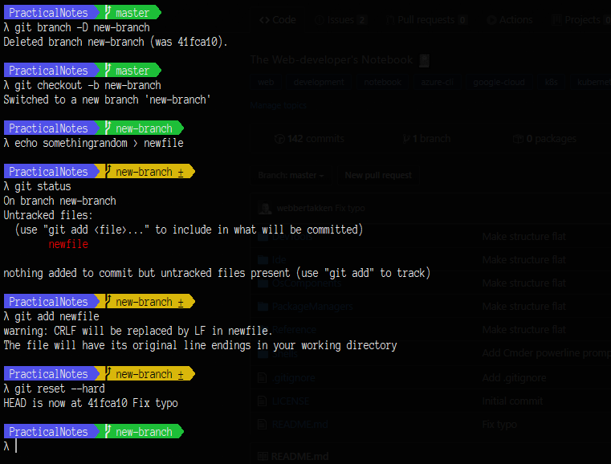

# Cmder

## Installation
Open powershell with administrative permissions and use chocolatey to install Cmder.
```powershell
\> choco install cmder
```

#### Common sense settings
Go to `Settings` > `General` and tick:
- [x] `Single instance mode (use existing window instead of running new instances)`

Go to `Settings` > `General` > `Size & Pos` and tick the boxes for:
- [x] `Snap to desktop edges`
- [x] `restore to active monitor`

#### Quake console
Go to `Settings` > `General` > `Quake style` and tick the boxes for:
- [x] `Quake-style slide down` _(slides your console down from the top)_
- [x] `Restore inactive window by hotkey`
- [x] `Restore to active monitor`

The default hotkey for opening and closing the quake-style console  is ``ctrl + ` ``.

#### Example four-panel setup
Go to `Settings` > `Startup` > `Tasks` and add a new task by cloning `cmd::Cmder as Admin`.

Name the task `Multi 4` set the following commands in the textarea:
```bash
*cmd /k ""%ConEmuDir%\..\init.bat" " -new_console:n:t
*cmd /k ""%ConEmuDir%\..\init.bat" " -cur_console:s1TVn:t
*cmd /k ""%ConEmuDir%\..\init.bat" " -cur_console:s1THn:t
*cmd /k ""%ConEmuDir%\..\init.bat" " -cur_console:s2THn:t
```

Name another task `Multi 3` and set the following commands in the textarea:
```bash
*cmd /k ""%ConEmuDir%\..\init.bat" " -new_console:n:t
>*cmd /k ""%ConEmuDir%\..\init.bat" " -cur_console:s1TVn:t
*cmd /k ""%ConEmuDir%\..\init.bat" " -cur_console:s1THn:t
```

Tick the boxes that read "default" for one of the created tasks.

Don't set the startup dir (`/dir`-parameter), so that external applications can provide their default directory.

Then go to `Settings` > `Startup` and choose `Multi` as the `Specified named task` to set it as default.

#### Result



## Powerline Prompt

> Official [docs](https://github.com/AmrEldib/cmder-powerline-prompt) for cmder powerline prompt

#### tl;dr

Install all fonts from [AnonymousPro](https://github.com/powerline/fonts/tree/master/AnonymousPro)

Clone cmder-powerline-prompt:
```powershell
cd c:/Repositories
git clone git@github.com:AmrEldib/cmder-powerline-prompt.git
```

Link configuration files:
```powershell
cd %CMDER_ROOT%/config  
mklink /H powerline_core.lua c:\Repositories\cmder-powerline-prompt\powerline_core.lua
mklink /H powerline_prompt.lua c:\Repositories\cmder-powerline-prompt\powerline_prompt.lua
mklink /H powerline_git.lua c:\Repositories\cmder-powerline-prompt\powerline_git.lua
```

Go to `Settings` > `General` and choose color scheme: `Cobalt2`.

Go to `Settings` > `General` > `Fonts` and select `Anonymice Powerline`.

#### Result: 



## IDE Integration
##### Integrate with IntelliJ IDE 

Works for all Intellij Editors such as 
_Webstorm_, _Rider_, _Android Studio_ and _PyCharm_.

- Open the IDE and go to `Settings` > `Tools` > `Terminal`.
- Set `Shell path` to the Cmder executable file.

##### Integrate with VS Code
- Open VS Code and go to `File` > `Preferences` > `Settings`.
- Search for terminal
- Set `"terminal.explorerKind"` to `"external"`
- Set `"terminal.external"` exec settings for your OS to the Cmder executable file.
